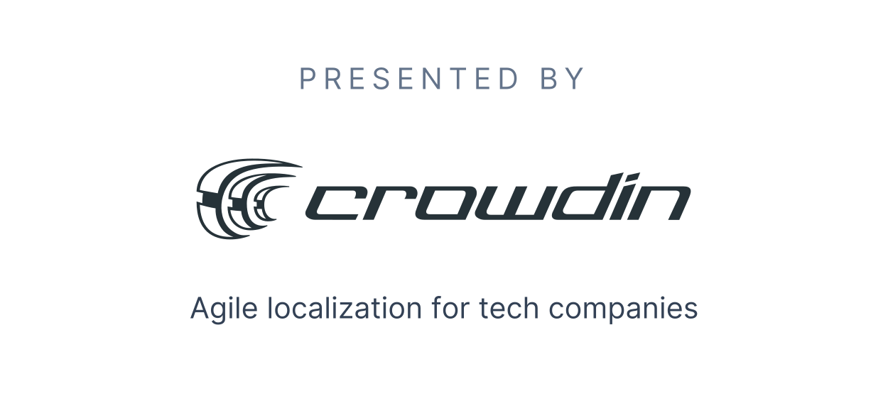

<h1 align="center">
  <br>
  <a href="https://next-intl-docs.vercel.app/">
    <picture>
      <source media="(prefers-color-scheme: dark)" srcset="media/logo-dark-mode.svg">
      <source media="(prefers-color-scheme: light)" srcset="media/logo.svg">
      
    </picture>
  </a>
  <br>
  <br>
</h1>

> Internationalization (i18n) for Next.js

## Features

Internationalization (i18n) is an essential part of the user experience, therefore `next-intl` gives you all the parts you need to get language nuances right.

- 🌟 **ICU message syntax**: Localize your messages with interpolation, cardinal & ordinal plurals, enum-based label selection and rich text.
- 📅 **Dates, times & numbers**: Apply appropriate formatting without worrying about server/client differences like time zones.
- ✅ **Type-safe**: Speed up development with autocompletion for message keys and catch typos early with compile-time checks.
- 💡 **Hooks-based API**: Learn a single API that can be used across your code base to turn translations into plain strings or rich text.
- 🚀 **Next.js-native and performance-obsessed**: App Router, Server Components, static rendering—pick the right tool for the right job, next-intl works everywhere.
- ⚔️ **Internationalized routing**: Provide unique pathnames per language and optionally localize pathnames for search engine optimization.

## What does it look like?

```jsx
// UserProfile.tsx
import {useTranslations} from 'next-intl';
 
export default function UserProfile({user}) {
  const t = useTranslations('UserProfile');
 
  return (
    <section>
      <h1>{t('title', {firstName: user.firstName})}</h1>
      <p>{t('membership', {memberSince: user.memberSince})}</p>
      <p>{t('followers', {count: user.numFollowers})}</p>
    </section>
  );
}
```

```js
// en.json
{
  "UserProfile": {
    "title": "{username}'s profile",
    "membership": "Member since {memberSince, date, short}",
    "followers": "{count, plural, ↵
                    =0 {No followers yet} ↵
                    =1 {One follower} ↵
                    other {# followers} ↵
                  }"
  }
}
```

### [→ Read the docs](https://next-intl-docs.vercel.app/)

<div align="center">
  <a href="https://next-intl-docs.vercel.app/redirect?href=https://crowdin.com" target="_blank">
    
  </a>
  <br>
  <p>Hosted on <a href="https://vercel.com?utm_source=next-intl&utm_campaign=oss">Vercel</a></p>
</div>
