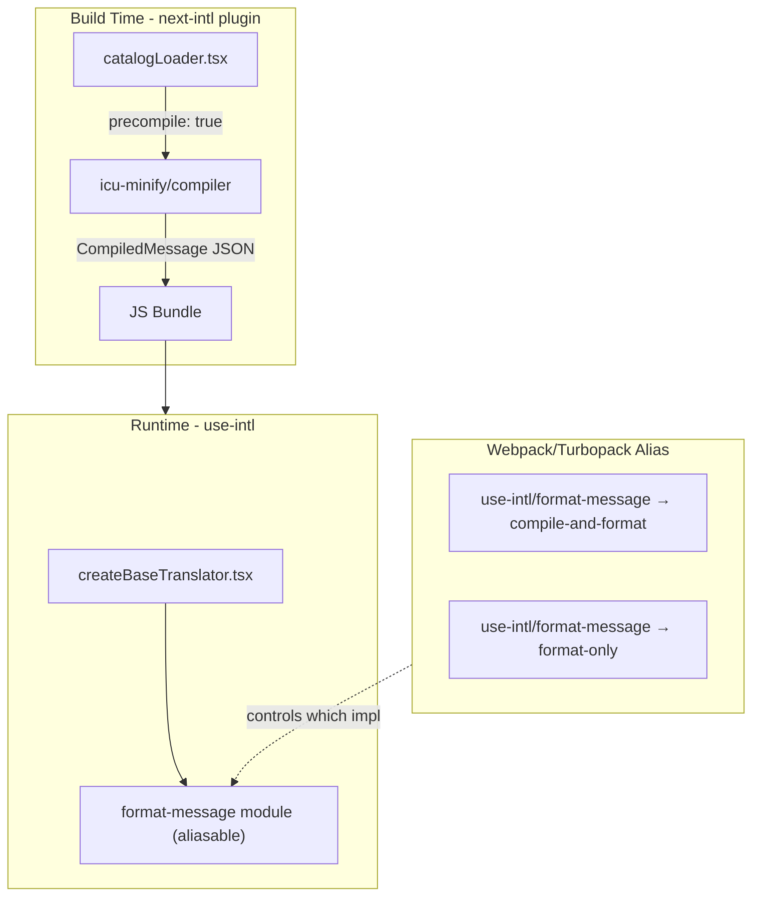

# icu-minify Integration into next-intl

## Goal

Integrate the `icu-minify` package into `next-intl` to enable **build-time message precompilation** with a minimal runtime footprint.

### Current State

- `use-intl` uses `intl-messageformat` to compile and format ICU messages at runtime
- This adds ~15KB to the bundle and requires parsing messages on every render
- The `icu-minify` package has been implemented with a compiler (~8KB, build-time only) and a tiny runtime formatter (~660 bytes)

### Target State

- When users enable `messages.precompile: true` in the next-intl plugin config:
  1. The catalog loader precompiles all ICU messages at build time using `icu-minify/compiler`
  2. A webpack/turbopack alias swaps the runtime to use `icu-minify/format` instead of `intl-messageformat`
- Result: Smaller bundles, faster message formatting, same API for users

### Key Constraint

- `use-intl` must continue working standalone (without next-intl) using the existing `intl-messageformat` approach
- The precompilation optimization is only available when using next-intl with the plugin

---

## Branch Strategy

- **Base branch**: `claude/icu-message-compiler-Ou4Uv`
- **Work branch**: Create a new branch from the base (e.g., `feat/icu-minify-integration`) and persist this prompt to ./plan.md
- **Commits**: Make granular commits after completing each todo step and indicate in the plan what is already completed
- **Critical issues**: When things don't go right, don't be afraid to ask for guidance from me. Try to solve problems that come up but before building workarounds that feel really strange, ask for help before starting with the next step.

---

## Architecture Overview



---

## Implementation Todos

### Phase 1: Add icu-minify Dependency to use-intl

- [x] **add-icu-minify-dep**: Add `icu-minify` as workspace dependency in `packages/use-intl/package.json`

### Phase 2: Create Format-Message Module in use-intl

- [x] **create-format-interface**: Design shared interface for formatMessage implementations
- [x] **create-compile-and-format**: Create `packages/use-intl/src/core/formatMessage/compileAndFormat.tsx` with existing intl-messageformat logic
- [x] **create-format-only**: Create `packages/use-intl/src/core/formatMessage/formatOnly.tsx` using icu-minify/format with dateTime→date/time conversion
- [x] **create-format-index**: Create `packages/use-intl/src/core/formatMessage/index.tsx` re-exporting compileAndFormat
- [x] **refactor-base-translator**: Update `createBaseTranslator.tsx` to use new formatMessage module
- [x] **update-use-intl-exports**: Add format-message exports to `packages/use-intl/package.json`
- [x] **update-use-intl-rollup**: Update `packages/use-intl/rollup.config.js` with new entry points

### Phase 3: Enable Precompilation in next-intl

- [x] **add-precompile-option**: Add `precompile` option to PluginConfig in `packages/next-intl/src/plugin/types.tsx`
- [x] **update-catalog-loader**: Update `packages/next-intl/src/plugin/catalog/catalogLoader.tsx` to precompile messages when enabled
- [x] **add-alias-logic**: Add webpack/turbopack alias in `packages/next-intl/src/plugin/getNextConfig.tsx` for precompile mode

### Phase 4: Verification

- [ ] **build-verify**: Build use-intl and verify dist contains both implementations
- [ ] **e2e-test**: Test end-to-end with example app using `precompile: true`

---

## Key Files to Modify

| File                                                      | Changes                              |
| --------------------------------------------------------- | ------------------------------------ |
| `packages/use-intl/package.json`                          | Add icu-minify dep, add exports      |
| `packages/use-intl/rollup.config.js`                      | Add new entry points                 |
| `packages/use-intl/src/core/createBaseTranslator.tsx`     | Extract format logic                 |
| `packages/use-intl/src/core/formatMessage/` (new)         | New module with both implementations |
| `packages/next-intl/src/plugin/types.tsx`                 | Add precompile option                |
| `packages/next-intl/src/plugin/catalog/catalogLoader.tsx` | Add precompilation                   |
| `packages/next-intl/src/plugin/getNextConfig.tsx`         | Add alias logic                      |

---

## Phase 2 Details

### 2.1 Extract message formatting logic from createBaseTranslator

Refactor `packages/use-intl/src/core/createBaseTranslator.tsx` to:

- Move the `IntlMessageFormat` usage and `createMessageFormatter` into a separate module
- Create a shared interface that both implementations will satisfy

### 2.2 Create compile-and-format implementation

Create `packages/use-intl/src/core/formatMessage/compileAndFormat.tsx`:

- Contains existing `intl-messageformat` logic (compile + format at runtime)
- Exports a `formatMessage` function with a unified interface

### 2.3 Create format-only implementation

Create `packages/use-intl/src/core/formatMessage/formatOnly.tsx`:

- Uses `icu-minify/format` for precompiled messages
- Same interface as compile-and-format
- Add conversion layer for `dateTime` → `date`/`time` formats (with TODO note to reevaluate)

### 2.4 Create index entry point

Create `packages/use-intl/src/core/formatMessage/index.tsx`:

- Re-exports from `compileAndFormat.tsx` by default
- This is the module that will be aliased

### 2.5 Update createBaseTranslator

Modify `createBaseTranslator.tsx` to import from `./formatMessage/index.js` instead of inline `intl-messageformat` usage.

### 2.6 Add exports to package.json

Update `packages/use-intl/package.json` exports:

```json
"./format-message": {
  "types": "./dist/types/core/formatMessage/index.d.ts",
  "development": "./dist/esm/development/core/formatMessage/index.js",
  "default": "./dist/esm/production/core/formatMessage/index.js"
},
"./format-message/compile-and-format": {
  "types": "./dist/types/core/formatMessage/compileAndFormat.d.ts",
  "development": "./dist/esm/development/core/formatMessage/compileAndFormat.js",
  "default": "./dist/esm/production/core/formatMessage/compileAndFormat.js"
},
"./format-message/format-only": {
  "types": "./dist/types/core/formatMessage/formatOnly.d.ts",
  "development": "./dist/esm/development/core/formatMessage/formatOnly.js",
  "default": "./dist/esm/production/core/formatMessage/formatOnly.js"
}
```

### 2.7 Update rollup config

Update `packages/use-intl/rollup.config.js` to include new entry points.

---

## Phase 3 Details

### 3.1 Add precompile option to PluginConfig

Update `packages/next-intl/src/plugin/types.tsx`:

```typescript
messages?: {
  path: string;
  format: MessagesFormat;
  locales: 'infer' | ReadonlyArray<string>;
  precompile?: boolean;  // NEW
};
```

### 3.2 Update catalogLoader to precompile

Modify `packages/next-intl/src/plugin/catalog/catalogLoader.tsx`:

- When `precompile: true`, use `icu-minify/compiler` to compile each message
- Output precompiled JSON instead of raw ICU strings

### 3.3 Add webpack/turbopack alias in getNextConfig

Update `packages/next-intl/src/plugin/getNextConfig.tsx`:

- When `messages.precompile: true`, add alias:
  - `use-intl/format-message` → `use-intl/format-message/format-only`

---

## Notes

- **dateTime conversion**: The format-only implementation will convert use-intl's unified `dateTime` format to separate `date`/`time` for icu-minify. Leave TODO to reevaluate if icu-minify should support unified dateTime.
- **Caching**: Catalog loader caching deferred to follow-up task.
- **Future optimization**: Could potentially use icu-minify for compile-and-format entry point too (compile once, format with tiny runtime).

---

## Follow-up Tasks (Post-Implementation)

- [ ] Add caching to catalog loader to avoid recompiling all messages on every reload
- [ ] Investigate using icu-minify for compile-and-format entry point
- [ ] Consider making icu-minify support unified `dateTime` namespace
- [ ] Add documentation for the `precompile` option
- [ ] Add size comparison benchmarks (before/after precompilation)
